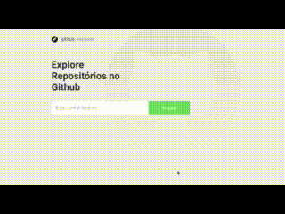

<p align="center">

</p>

<h2 align="center">
  
</h2>

<h1 align='center'>
    
</h1>

<h1 align='center'>
  
</h1>

# Índice

- [Sobre](#-sobre)
- [Tecnologias Utilizadas](#-tecnologias-utilizadas)
- [Como baixar o projeto](#-como-baixar-o-projeto)

## 🚀 Sobre a aplicação

A aplicação tem como objetivo buscar, listar e explorar repositórios do github, podendo acessar, também, suas issues. A aplicação foi feita com ReactJS e Typescript, utilizando a api do github para buscar os dados.d

## 🚀 Tecnologias utilizadas

O projeto foi desenvolvido utilizando as seguintes tecnologias

- [ReactJS](https://reactjs.org)
- [Typescript](https://www.typescriptlang.org/)
- [Axios](https://github.com/axios/axios)

## 🗂 Como baixar o projeto

```bash

    # Clonar o repositório
    $ git clone https://github.com/RomuloBraga92/Github-Explorer

    # Entrar no diretório
    $ cd github-explorer

    # Instalar as dependências
    $ yarn install

    # Iniciar o projeto
    $ yarn start
```

---
Criado com ❤️ por Romulo Braga
